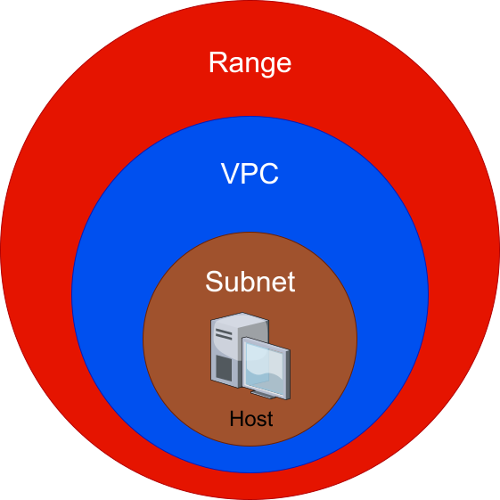

# 🧠 Lab Hierarchy

Every lab you build follows a logical network hierarchy. This structure helps you organize even the most complex environments.

* **Range**: The top-level container for your entire deployed lab.

* **VPC**: (Virtual Private Cloud) An isolated network within your Range. A Range can have multiple VPCs.

* **Subnet**: A subdivision of a VPC's IP address range where hosts live.

* **Host**: An individual virtual machine (VM) running within a Subnet.

Below is a visualization of how these objects relate to one another:

