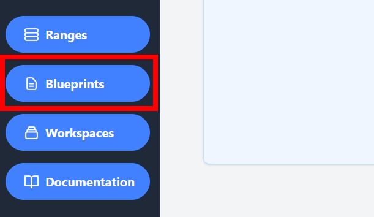
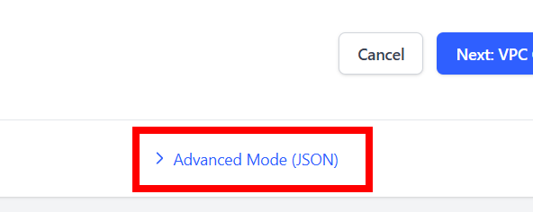
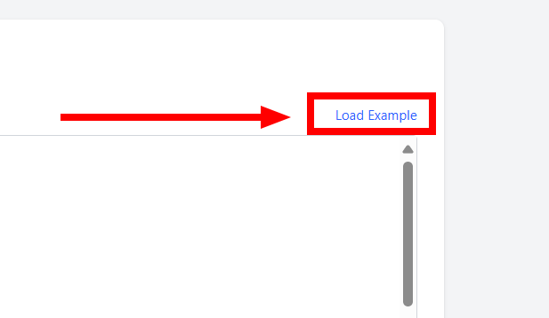
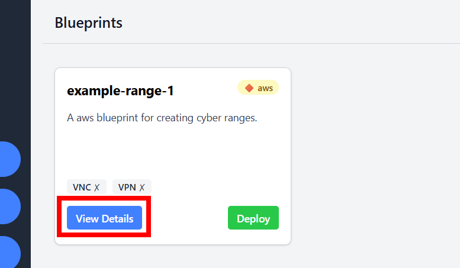
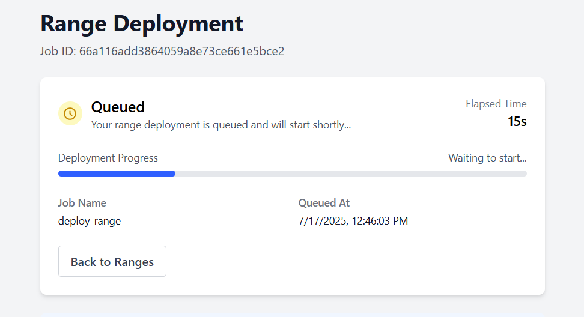
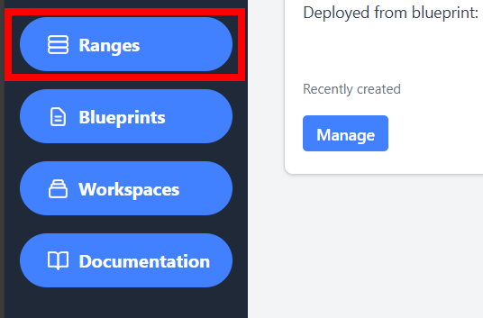
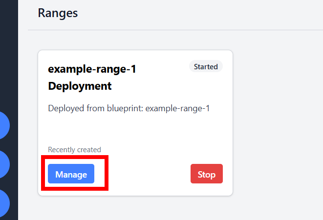

# 🚀 Deploy Your First Range

This guide will walk you through creating and deploying a simple lab environment in under 5 minutes.

**What you'll learn:**

* How to add your cloud provider credentials to OpenLabs.
* How to create a **Blueprint** using a JSON template.
* How to deploy a **Blueprint** into a live **Range**.
* How to view and delete your deployed **Range**.

> [!IMPORTANT]
> **Prerequisites**
> Before you begin, ensure you have:
> 1.  Completed the **[Installation Guide](../guides/installation.md)** so OpenLabs is running.
> 2.  Your cloud provider credentials (e.g., AWS Access Key & Secret Key) ready.

---

## 🔑 Step 1: Add Credentials

First, let's connect your cloud provider account to OpenLabs.

1.  Navigate to [http://localhost:3000](http://localhost:3000) or to your OpenLabs instance and create your account.
2.  Once logged in, click the **Settings** icon in the bottom-left corner.

    

3.  Scroll down to the **Cloud Credentials** section and enter your provider's keys. A successful connection will be marked with a green `Configured` status.

    

## 📘 Step 2: Create a Blueprint

Now lets create our first [Blueprint](../explanation/core-components.md). This will define the structure of our lab environment.

## 📘 Step 2: Create a Blueprint

Next, you'll define the structure of your lab using a [Blueprint](../explanation/core-components.md).

1.  Navigate to the **Blueprints** dashboard from the main menu.

    

2.  Click the **Create Blueprint** button.
3.  While OpenLabs offers a visual builder, this guide uses the JSON editor for speed. Select the **Advanced Mode** tab.

    

4.  Click **Load Example** in the top-right corner to populate the editor with a sample configuration.

    

5.  Click **Skip to Review** to see a summary and an interactive network diagram of the blueprint.
6.  Finally, click **Create Blueprint** to save it.

## 🚀 Step 3: Deploy the Blueprint

Now, let's deploy the blueprint to create a live [Range](../explanation/core-components.md).

1.  After creating your blueprint, you'll be on the **Blueprints** dashboard. Find your new blueprint and click **View Details**.

    

2.  On the details page, review the summary and click **Deploy Blueprint**.
3.  You'll be redirected to the deployment status page. The process takes about 3 minutes. The deployment runs in the background, so you can navigate to other parts of the app while you wait.

    

4.  Once complete, navigate to the **Ranges** dashboard.

    

5.  Click **Manage** on your new range to view its details, including host information and connection details.

    

## 🎉 Success

Congratulations on deploying your first [Range](../explanation/core-components.md). Feel free to explore the different features for managing and accessing it. Once you are finished, you can destroy the range by clicking the *Delete Range* button.

You can continue learning about OpenLabs by looking through our [Explanation Section](../explanation/index.md).