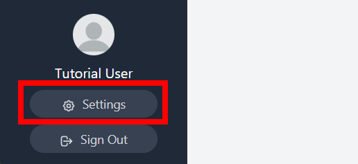
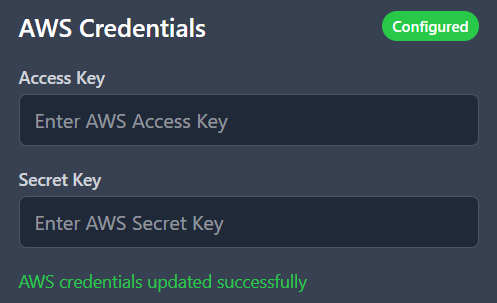

# 🚀 Quickstart: Deploy Your First Lab

This guide will walk you through deploying a simple two-host lab environment in under 5 minutes.

> [!IMPORTANT]
> Before you begin, you must have:
>
> 1. Completed the **[Installation Guide](../guides/installation.md)** so OpenLabs is running.
> 2. Your cloud provider credentials (e.g., AWS Access Key & Secret Key) ready.

## 🔑 Step 1: Sign Up & Add Credentials

First, let's create your OpenLabs account and add your cloud credentials.

1.  Navigate to [http://localhost:3000](http://localhost:3000) and create a new account.
2.  Once logged in, access your account's *Settings* in the bottom left corner.

    

3.  Scroll to the bottom of the page and input your cloud credentials. Once they are successfully added, that provider's box will be marked green and *Configured* at the top.

    
    
## Step 2: Create a Blueprint

Now lets create our first blueprint. Blueprints 

Copy the example 2 host blueprint below:

```yaml

```